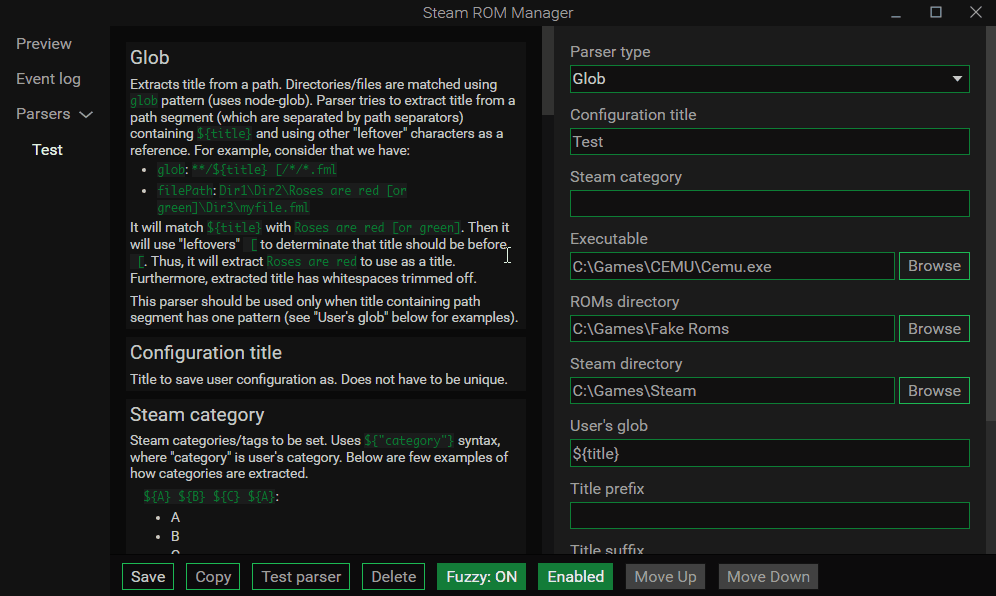

Want to play some old or new emulator games on your couch? Going to add them to the Steam and use big picture mode? Well, fear not! It is no longer a chore that ruins everyone's mood. Introducing **Steam ROM Manager**! 

# Features

## Instructions and examples

Use instructions and examples to create your own parser. When creating a parser configuration, you can read side-by-side about each input field and how does it work.

## Verbose information about what your parser is doing

Parser not working or is working not as you intended it to? Test it to see what's what!

## Easy to use

Finally got that parser working? Go to preview and generate new list!

## Fuzzy title matching

Can't seem to find images for your title, but they are certainly on supported websites? Could it be due to some missing or mistypes characters in your title? Fuzzy matching to the rescue! It will match closest title to the list of titles downloaded from **SteamGridDB**.

## Use local images

No images found or you just want to use your own images? Fear not! Steam ROM Manager supports local images! (Thanks to **doZennn** from **SteamGridDB** who said, and was right, that this is a must have feature.)

## Other features

- Change almost every color by accessing color picker with **Alt + C**. If you lost it or can't reach it anymore, use **Alt + R** to reset it's position.
- Multiple user configuration support.
- Fully support image downloads from **SteamGridDB**, **retrogaming.cloud** and partially from **ConsoleGrid**.

# Executable arguments for emulators

While you can freely choose what your executable arguments should be, here are some argument examples for emulators that you might want.

## Dolphin

`--exec="${filePath}" --batch --confirm=false`

## Cemu

`-f -g "${filePath}"`

# Special thanks

- Thank you **doZennn** for providing title list for fuzzy matching and an icon. Also testing this app.