# Star Tracker Report

**2026-07-23** | Total: **2499 stars** | Change: **+4**

> Compared to snapshot from 2026-07-22

## 📈 Star Trend

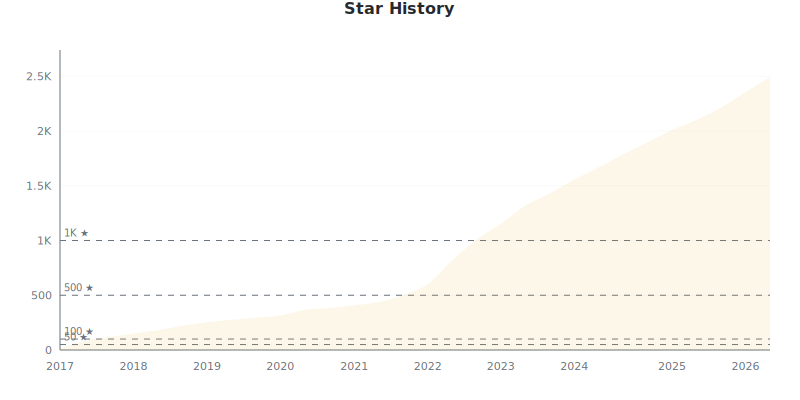

### By Repository

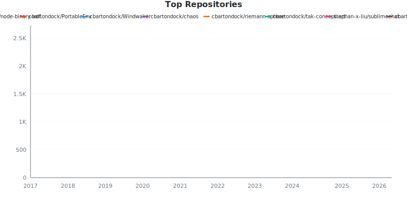

Individual Repository Charts

#### SteamGridDB/steam-rom-manager

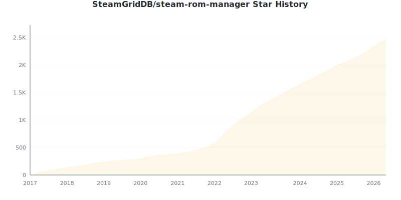

#### cbartondock/node-binary-vdf

#### cbartondock/PortableEnv

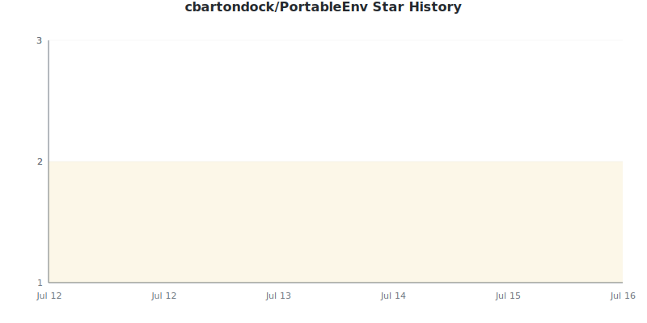

#### cbartondock/Windwaker

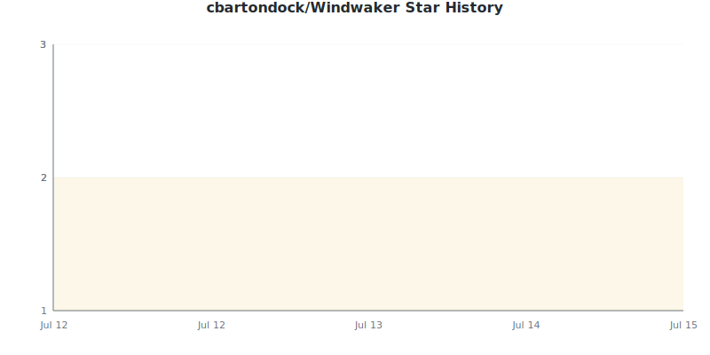

#### cbartondock/chaos

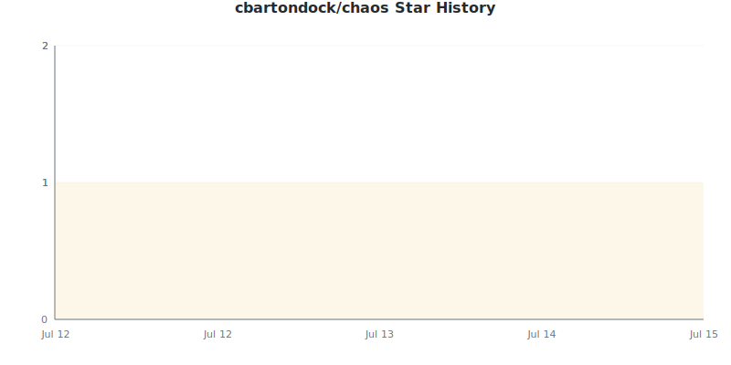

#### cbartondock/riemann-sphere

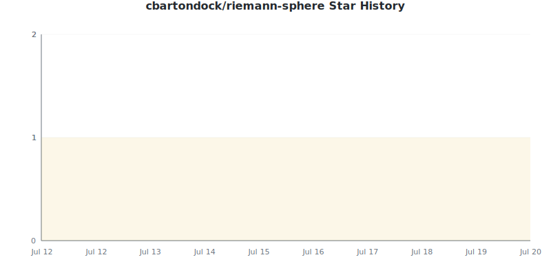

#### cbartondock/tak-concept-art

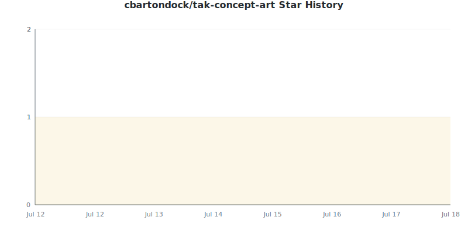

#### stephan-x-liu/sublimechat

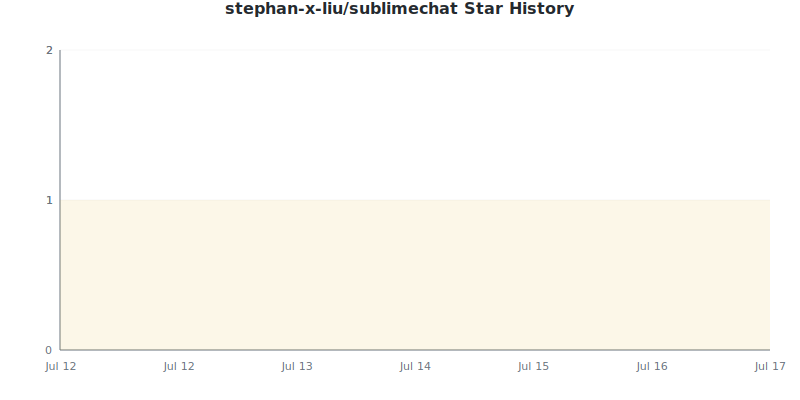

#### cbartondock/academicpages.github.io

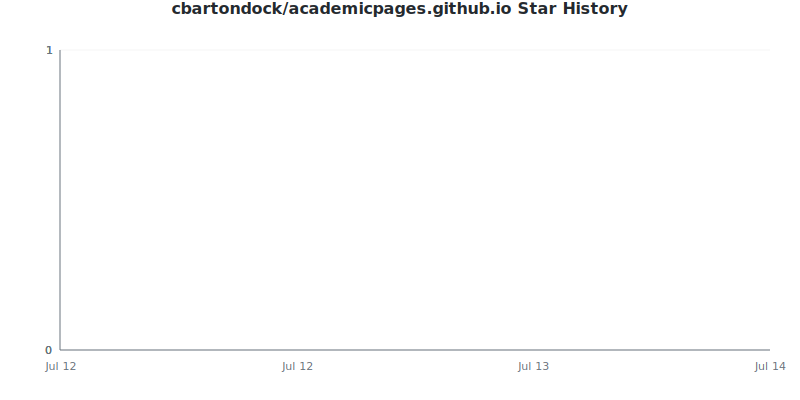

#### cbartondock/discordBadge

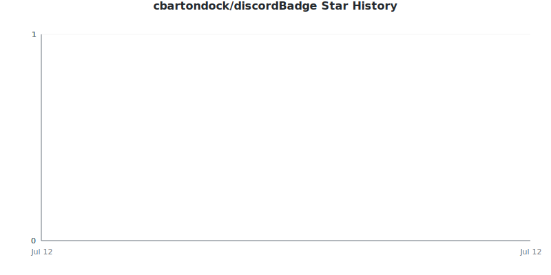

## Repositories

| Repositories | Stars | Change | Trend |
|:-----------|------:|-------:|:-----:|
| [SteamGridDB/steam-rom-manager](https://github.com/SteamGridDB/steam-rom-manager) | 2488 | +4 | ⬆️ |
| [cbartondock/node-binary-vdf](https://github.com/cbartondock/node-binary-vdf) | 3 | 0 | ➖ |
| [cbartondock/PortableEnv](https://github.com/cbartondock/PortableEnv) | 2 | 0 | ➖ |
| [cbartondock/Windwaker](https://github.com/cbartondock/Windwaker) | 2 | 0 | ➖ |
| [cbartondock/chaos](https://github.com/cbartondock/chaos) | 1 | 0 | ➖ |
| [cbartondock/riemann-sphere](https://github.com/cbartondock/riemann-sphere) | 1 | 0 | ➖ |
| [cbartondock/tak-concept-art](https://github.com/cbartondock/tak-concept-art) | 1 | 0 | ➖ |
| [stephan-x-liu/sublimechat](https://github.com/stephan-x-liu/sublimechat) | 1 | 0 | ➖ |
| [cbartondock/academicpages.github.io](https://github.com/cbartondock/academicpages.github.io) | 0 | 0 | ➖ |
| [cbartondock/discordBadge](https://github.com/cbartondock/discordBadge) | 0 | 0 | ➖ |
| [cbartondock/enes106_diagrams](https://github.com/cbartondock/enes106_diagrams) | 0 | 0 | ➖ |
| [cbartondock/flu_trends](https://github.com/cbartondock/flu_trends) | 0 | 0 | ➖ |
| [cbartondock/image-size](https://github.com/cbartondock/image-size) | 0 | 0 | ➖ |
| [cbartondock/learning](https://github.com/cbartondock/learning) | 0 | 0 | ➖ |
| [cbartondock/LipschitzAnalysisofGenPR](https://github.com/cbartondock/LipschitzAnalysisofGenPR) | 0 | 0 | ➖ |
| [cbartondock/prevbaseautomation](https://github.com/cbartondock/prevbaseautomation) | 0 | 0 | ➖ |
| [cbartondock/Python-Server-Stuff](https://github.com/cbartondock/Python-Server-Stuff) | 0 | 0 | ➖ |
| [cbartondock/QualityCheckFork](https://github.com/cbartondock/QualityCheckFork) | 0 | 0 | ➖ |
| [cbartondock/Raspberry-Pi-Project](https://github.com/cbartondock/Raspberry-Pi-Project) | 0 | 0 | ➖ |
| [cbartondock/rubyapp](https://github.com/cbartondock/rubyapp) | 0 | 0 | ➖ |
| [cbartondock/sample_app](https://github.com/cbartondock/sample_app) | 0 | 0 | ➖ |
| [cbartondock/skew_stuff](https://github.com/cbartondock/skew_stuff) | 0 | 0 | ➖ |
| [EmADgine/quomp](https://github.com/EmADgine/quomp) | 0 | 0 | ➖ |

## Summary

- **Stars gained:** 4
- **Stars lost:** 0
- **Net change:** +4

## 👤 New Stargazers

5 new stargazers since last run

SteamGridDB/steam-rom-manager (5 new)

-  [Y0ICHI](https://github.com/Y0ICHI): starred on 2026-07-22
-  [Juanragb](https://github.com/Juanragb): starred on 2026-07-22
-  [micv389](https://github.com/micv389): starred on 2026-07-22
-  [fasalgad](https://github.com/fasalgad): starred on 2026-07-22
-  [Exaelus](https://github.com/Exaelus): starred on 2025-09-08

## 🔮 Growth Forecast

**Aggregate Forecast**

| Method | Week 1 | Week 2 | Week 3 | Week 4 |
|:---|---:|---:|---:|---:|
| Linear Regression | 2504 | 2510 | 2515 | 2520 |
| Weighted Moving Average | 2505 | 2512 | 2518 | 2525 |

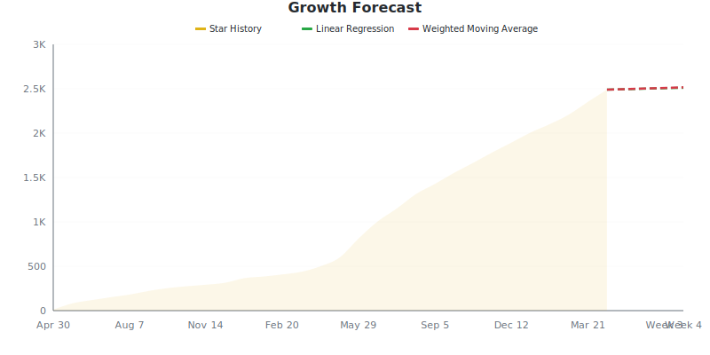

### By Repository

SteamGridDB/steam-rom-manager

**SteamGridDB/steam-rom-manager**

| Method | Week 1 | Week 2 | Week 3 | Week 4 |
|:---|---:|---:|---:|---:|
| Linear Regression | 2493 | 2499 | 2504 | 2509 |
| Weighted Moving Average | 2494 | 2501 | 2507 | 2514 |

cbartondock/node-binary-vdf

**cbartondock/node-binary-vdf**

| Method | Week 1 | Week 2 | Week 3 | Week 4 |
|:---|---:|---:|---:|---:|
| Linear Regression | 3 | 3 | 3 | 3 |
| Weighted Moving Average | 3 | 3 | 3 | 3 |

cbartondock/PortableEnv

**cbartondock/PortableEnv**

| Method | Week 1 | Week 2 | Week 3 | Week 4 |
|:---|---:|---:|---:|---:|
| Linear Regression | 2 | 2 | 2 | 2 |
| Weighted Moving Average | 2 | 2 | 2 | 2 |

cbartondock/Windwaker

**cbartondock/Windwaker**

| Method | Week 1 | Week 2 | Week 3 | Week 4 |
|:---|---:|---:|---:|---:|
| Linear Regression | 2 | 2 | 2 | 2 |
| Weighted Moving Average | 2 | 2 | 2 | 2 |

cbartondock/chaos

**cbartondock/chaos**

| Method | Week 1 | Week 2 | Week 3 | Week 4 |
|:---|---:|---:|---:|---:|
| Linear Regression | 1 | 1 | 1 | 1 |
| Weighted Moving Average | 1 | 1 | 1 | 1 |

cbartondock/riemann-sphere

**cbartondock/riemann-sphere**

| Method | Week 1 | Week 2 | Week 3 | Week 4 |
|:---|---:|---:|---:|---:|
| Linear Regression | 1 | 1 | 1 | 1 |
| Weighted Moving Average | 1 | 1 | 1 | 1 |

cbartondock/tak-concept-art

**cbartondock/tak-concept-art**

| Method | Week 1 | Week 2 | Week 3 | Week 4 |
|:---|---:|---:|---:|---:|
| Linear Regression | 1 | 1 | 1 | 1 |
| Weighted Moving Average | 1 | 1 | 1 | 1 |

stephan-x-liu/sublimechat

**stephan-x-liu/sublimechat**

| Method | Week 1 | Week 2 | Week 3 | Week 4 |
|:---|---:|---:|---:|---:|
| Linear Regression | 1 | 1 | 1 | 1 |
| Weighted Moving Average | 1 | 1 | 1 | 1 |

cbartondock/academicpages.github.io

**cbartondock/academicpages.github.io**

| Method | Week 1 | Week 2 | Week 3 | Week 4 |
|:---|---:|---:|---:|---:|
| Linear Regression | 0 | 0 | 0 | 0 |
| Weighted Moving Average | 0 | 0 | 0 | 0 |

cbartondock/discordBadge

**cbartondock/discordBadge**

| Method | Week 1 | Week 2 | Week 3 | Week 4 |
|:---|---:|---:|---:|---:|
| Linear Regression | 0 | 0 | 0 | 0 |
| Weighted Moving Average | 0 | 0 | 0 | 0 |

---
*Generated by [GitHub Star Tracker](https://github.com/fbuireu/github-star-tracker) on 2026-07-23T02:32:23.931Z*

*Made with 🤘 by [Ferran Buireu](https://github.com/fbuireu)*

