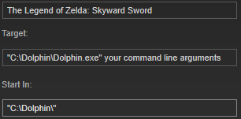

# Command line arguments (optional) `[supports variables]`{.noWrap}

Arguments which are appended to executable to produce final shortcut. Most of the time you will want to set it using provided parser variables.

## Examples By System

### RetroArch

```
-L cores${/}YOUR_CORE.dll "${filePath}"
```

### Cemu (WiiU)

```
-f -g "${filePath}"
```

### Dolphin Emu (Gamecube and Wii)

```
--exec="${filePath}" --batch --confirm=false
```

### Project64 2.3+ (N64)

```
"${filePath}"
```

### Mupen64+ (N64)

```
--fullscreen "${filePath}"
```

### DeSmuME (Nintendo DS)

```
"${filePath}"
```

### mGBA (Gameboy, Gameboy Color, and Gameboy Advance)

```
-f "${filePath}"
```

### Nestopia (NES/Famicom)

```
"${filePath}" -video fullscreen bpp : 16 -video fullscreen width : 1024 -video fullscreen height : 768 -preferences fullscreen on start : yes -view size fullscreen : stretched
```

### higan (NES/Famicom, SNES/Famicom, Gameboy, Gameboy Color, Gameboy Advance)

```
"${filePath}"
```

### nullDC (Sega Dreamcast)

```
-config nullDC_GUI:Fullscreen=1 -config ImageReader:DefaultImage="${filePath}"
```

### Kega Fusion (Sega Genesis and Sega 32X)

```
"${filePath}" -gen -auto -fullscreen
```

### RPCS3 (Sony Playstation 3)

```
"${filePath}"
```

### PCSX2 (Sony Playstation 2)

```
--fullscreen --nogui "${filePath}"
```

### PCSX-R (Sony Playstation 1)

```
-nogui -cdfile "${filePath}"
```

### ePSXe (Sony Playstation 1)

```
-f -nogui -loadbin "${filePath}"
```

### Xebra (Sony Playstation 1)

```
-IMAGE "${filePath}" -RUN1 -FULL
```

### Mednafen (Sony Playstation 1, NES/Famicom, SNES/Super Famicom, etc.)

```
"${filePath}"
```

### PPSSPP (Sony Playstation Portable)

```
"${filePath}"
```

## What does "Append arguments to executable" do?

Instead of adding arguments to Steam's launch options:

 {.fitImage.center}

arguments are appended to target as shown below:

 {.fitImage.center}

This setting is used to influence Steam's APP ID.

## Directory variables

| Variable (case-insensitive) | Corresponding value                       |
| --------------------------: | :---------------------------------------- |
|                 `${exeDir}` | Executable directory                      |
|                 `${romDir}` | ROMs directory                            |
|               `${steamDir}` | Steam directory                           |
|             `${startInDir}` | "StartIn" directory                       |
|                `${fileDir}` | Files returned by a parser or a directory |

In case executable directory input is left **empty**, `${exeDir}`{.noWrap} is equal to `${fileDir}`{.noWrap}. Moreover, if "StartIn" directory is left **empty**, `${startInDir}`{.noWrap} is equal to `${exeDir}`{.noWrap}.

## Name variables

| Variable (case-insensitive) | Corresponding value                                             |
| --------------------------: | :-------------------------------------------------------------- |
|                `${exeName}` | Name of executable (without extension)                          |
|               `${fileName}` | Name of file which was returned by a parser (without extension) |

In case executable directory input is left **empty**, `${exeName}`{.noWrap} is equal to `${fileName}`{.noWrap}.

## Extension variables

| Variable (case-insensitive) | Corresponding value                                           |
| --------------------------: | :------------------------------------------------------------ |
|                 `${exeExt}` | Extension of executable (with a dot)                          |
|                `${fileExt}` | Extension of file which was returned by a parser (with a dot) |

In case executable directory input is left **empty**, `${exeExt}`{.noWrap} is equal to `${fileExt}`{.noWrap}.

## Path variables

| Variable (case-insensitive) | Corresponding value                                |
| --------------------------: | :------------------------------------------------- |
|                `${exePath}` | Full path to an executable                         |
|               `${filePath}` | Full path to a file which was returned by a parser |

In case executable directory input is left **empty**, `${exePath}`{.noWrap} is equal to `${filePath}`{.noWrap}.

## Parser variables

| Variable (case-insensitive) | Corresponding value                              |
| --------------------------: | :----------------------------------------------- |
|                  `${title}` | Extracted title                                  |
|             `${fuzzyTitle}` | Fuzzy matched title                              |
|             `${finalTitle}` | Title which was the end result of title modifier |

In case fuzzy matching **fails** or is **disabled**, `${fuzzyTitle}`{.noWrap} is equal to `${title}`{.noWrap}.

## Function variables

|                             Variable (case-insensitive) | Corresponding function                                                                                                 |
| ------------------------------------------------------: | :--------------------------------------------------------------------------------------------------------------------- |
|               `${regex\|input\|substitution(optional)}` | Executes regex on input. Supports `u`, `g` and `i` flags (captured groups are joined, unless substitution is provided) |
|                                          `${uc\|input}` | Uppercase variable. Transforms input to uppercase                                                                      |
|                                          `${lc\|input}` | Lowercase variable. Transforms input to lowercase                                                                      |
|                                    `${cv:group\|input}` | Change input with matched custom variable (group is optional)                                                          |
|                                         `${rdc\|input}` | Replace diacritic input characters with their latin equivalent                                                         |
| `${os:[win\|mac\|linux]\|on match\|no match(optional)}` | If OS matches, uses `on match` value or `no match` otherwise                                                           |

### Function variable example

Let's say that `${title}` variable equals to `Pokémon (USA) (Disc 1).iso`. Then these variables:

```
${/.*/|${title}}                           //Matches everything
${/(.*)/|${title}}                         //Captures everything
${/(\(.*?\))/|${title}|}                   //Captures all brackets and substitutes with nothing
${/(\(Disc\s?[0-9]\))/|${title}}           //Captures "Disc..." part
${uc|${/(\(Disc\s?[0-9]\))/|${title}}}     //Captures "Disc..." part and transforms it to uppercase
${rdc|${title}}                            //Replace diacritic characters (in this case: é -> e)
file${os:linux|.so|${os:win|.dll}}         //Selects correct file extension for OS
```

will be replaced with these:

```
Pokémon (USA) (Disc 1).iso
Pokémon (USA) (Disc 1).iso
Pokémon.iso
(Disc 1)
(DISC 1)
Pokemon (USA) (Disc 1).iso

--On linux:
file.so
--On Windows:
file.dll
--On Mac OS:
file
```
