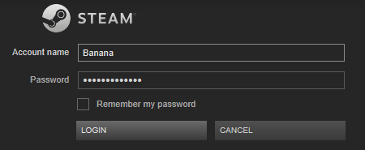

# Analisador de atalho não SRM

Este analisador importa atalhos Steam não SRM para o SRM para que sua arte possa ser gerenciada. Ele não adiciona atalhos e, como tal, é um analisador `Somente Arte'. Este analisador requer que o campo `Contas de usuário\` seja definido.

## Contas de usuário

Usado para limitar a configuração a contas de usuário específicas. Para definir contas de usuário, a seguinte sintaxe deve ser usada:

```
${...}
```

Você **deve** usar o nome de usuário usado para **fazer login** no Steam **se** [usar credenciais da conta](#what-does-use-account-credentials-do) estiver ativado:

 {.fitImage .center}

Por exemplo, é assim que você especifica a conta para "Banana" e "Apple":

```
${Banana}${Apple}
```

Você também pode limitar contas especificando seus ids diretamente. Por Exemplo:

```
${56489124}${21987424}
```

Limitaria a pesquisa a `steam/userdata/56489124` e `steam/userdata/21987424`.
