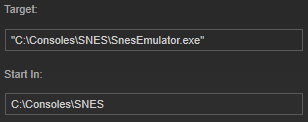

#

If `"Start In" Directory` is unset it defaults to the executable's directory. If not executable is set, it defaults to the directory of the ${filePath} variable:

 {.fitImage.center}

此选项允许您指定任何目录作为 “Start In”：

 {.fitImage.center}

当您使用批处理文件启动模拟器和游戏时，如果模拟器需要特定的 “Start In” 才能正常工作，则此功能非常有用。

## 快捷方式直通

如果您启用了 “Follow .lnk 到目标” 选项，并且您的可执行文件是 “.lnk” 文件，即快捷方式，则无论您在此字段中输入什么内容都将被覆盖为该快捷方式目标的目录。 将来，它将被覆盖为该快捷方式的起始目录。
