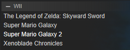

# Steam 类别（可选）`[支持变量]`{.noWrap}

也被称为“标签”，可用于在 Steam 中对应用程序进行分组。 为了设置 Steam 类别，必须使用以下语法：

```
${...}
```

例如，这是如何为 “WII” 和 “GBA”（与 “ROMS” 配对）类别指定的示例：

```
${WII}
```

```
${GBA}${ROMS}
```

这是 “WII” 类别在 Steam 中的样子：



## 表情符号和非标准 Unicode 字符

请注意，此字段与类别名称中的表情符号（如`🎮`）完全兼容。

您可以在这里找到它们的列表：[https://copychar.cc/](https://copychar.cc/)
