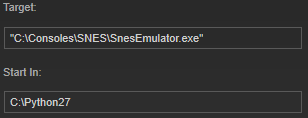

# "Start In" directory (optional)

By default "Start In" directory is set to executable's directory:

 {.fitImage .center}

This option allows you to specify any directory you want as a "Start In" directory:

 {.fitImage .center}

It is useful when you're using batch files to start emulator and a game, but emulator requires a specific "Start In" directory to work properly.
